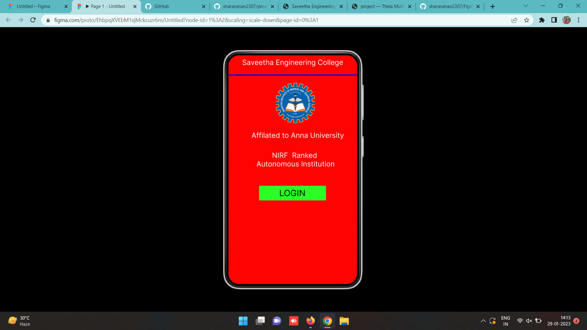
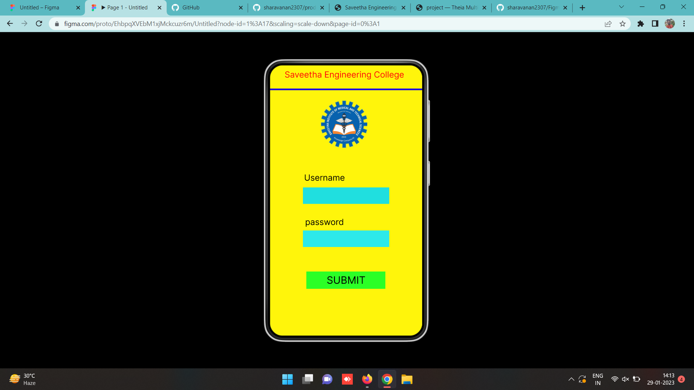
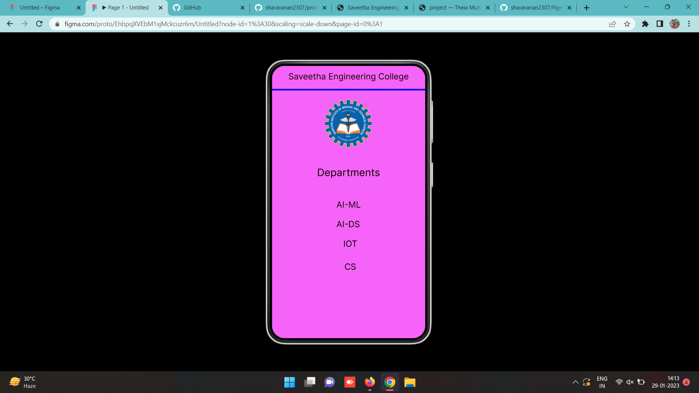

# Event Registration Web Application

## AIM:
To design, develop and deploy a web application for event registration.

## DESIGN STEPS:

### Step 1:
Create a new frame.

### Step 2:
Select any one preset size of your choice.

### Step 3:
Select the shapes you need.

### Step 4:
Import images as needed.

### Step 5:
Create pages based on your need and link them.

### Step 6:

Validate the HTML and CSS code.

### Step 6:

Publish the website in the given URL.

## DESIGN TOOL:
Figma

## code:
```
/* Home Page */
position: relative;
width: 360px;
height: 640px;
background: #FF0303;

/* login page */
position: relative;
width: 360px;
height: 640px;
background: #FFF50B;

/* Saveetha Engineering College */
position: absolute;
width: 324px;
height: 36px;
left: 18px;
top: 13px;
font-family: 'Inter';
font-style: normal;
font-weight: 400;
font-size: 20px;
line-height: 24px;
text-align: center;
color: #120202;

/* Line 3 */
position: absolute;
width: 360px;
height: 0px;
left: 0px;
top: 56px;
border: 4px solid #1706E4;

/* Logo 3 */
position: absolute;
width: 109px;
height: 113px;
left: 125px;
top: 79px;
background: url(Logo.png);
border-radius: 42px;

/* Departments */
position: absolute;
width: 148px;
height: 29px;
left: 106px;
top: 236px;
font-family: 'Inter';
font-style: normal;
font-weight: 400;
font-size: 24px;
line-height: 29px;

/* identical to box height */
text-align: center;
color: #0C0101;

/* IOT */
position: absolute;
width: 56px;
height: 24px;
left: 156px;
top: 406px;
font-family: 'Inter';
font-style: normal;
font-weight: 400;
font-size: 20px;
line-height: 24px;
text-align: center;
color: #000000;

/* CS */
position: absolute;
width: 56px;
height: 24px;
left: 156px;
top: 460px;
font-family: 'Inter';
font-style: normal;
font-weight: 400;
font-size: 20px;
line-height: 24px;
text-align: center;
color: #000000;

/* AI-ML */
position: absolute;
width: 58px;
height: 24px;
left: 151px;
top: 314px;
font-family: 'Inter';
font-style: normal;
font-weight: 400;
font-size: 20px;
line-height: 24px;
text-align: center;
color: #100606;

/* AI-DS */
position: absolute;
width: 56px;
height: 24px;
left: 151px;
top: 360px;
font-family: 'Inter';
font-style: normal;
font-weight: 400;
font-size: 20px;
line-height: 24px;
text-align: center;
color: #120202;
```
## OUTPUT:




## RESULT:
The program to design, develop and deploy a web application for event registration is completed successfully.